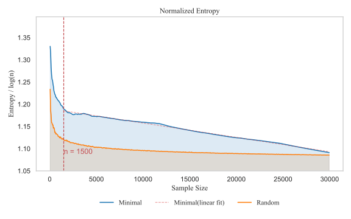

# Entropy-Based Analysis for Minimal Retrieval Augmented Generation (MinRAG)

This README provides supplementary explanations of our entropy-based analysis and sampling methodology for **Minimal Retrieval Augmented Generation (MinRAG)**.

---

## 1. Problem Statement

Given a knowledge base of N information chunks, we aim to identify the **minimal subset** S with |S| = n << N that:

- Maximizes **knowledge coverage**
- Minimizes **redundancy**

The optimization problem is formulated as:

$$
\begin{aligned}
\min_{S \subset \{1,...,N\}} & \quad |S| \\
\text{subject to} & \quad C(S) \geq 0.95 \\
                  & \quad H_n(S) \geq \tau
\end{aligned}
$$

where:

- C(S) = knowledge coverage ratio
- H_n(S) = normalized entropy
- τ = minimum entropy threshold

---

## 2. Binary Information-Knowledge Matrix Construction

We construct a binary matrix B ∈ {0,1}^{N×M}:

- N = 32,898 → total information chunks  
- M = 234 → unique hypertension-related knowledge points  
- B_ij = 1 if chunk i covers knowledge point j, else 0

For a subset S of size n, the corresponding sub-matrix is:

$$
B_S ∈ {0,1}^{n × M}
$$

---

## 3. Entropy Calculation Methodology

### (a) Smoothed Entropy

Additive smoothing prevents numerical instability:

$$
B' = B_S + \frac{\alpha}{nM}, \quad \alpha = 10^{-6}
$$

### (b) Joint Probability Distribution

Normalize the smoothed matrix to obtain probabilities:

$$
P_{ij} = \frac{B'_{ij}}{\sum_{i=1}^{n}\sum_{j=1}^{M} B'_{ij}}
$$

Then compute **Shannon entropy**:

$$
H(S) = -\sum_{i=1}^{n}\sum_{j=1}^{M} P_{ij} \log_2 P_{ij}
$$

### (c) Normalized Entropy

To compare across sample sizes n, we define:

$$
H_n(S) = \frac{H(S)}{\log_2 n}
$$

This normalization measures **information gain efficiency per chunk**.

---

## 4. Sampling Strategies

### 4.1 Random Sampling

Uniformly sample n chunks:

$$
P(i ∈ S_{random}) = \frac{n}{N}, \quad ∀ i
$$

### 4.2 Minimal Sampling (Greedy Algorithm)

Greedy MinRAG prioritizes coverage and entropy:

**Algorithm:**

1. Initialize S = ∅, K = ∅ (covered knowledge points)
2. While |S| < n:
   - Compute new coverage ΔK_i
   - Compute individual entropy H_i
   - Select i* = argmax_i { ΔK_i + β·H_i }
3. Update S and K

β = 0.1 weights entropy against coverage gain.

---

## 5. Individual Chunk Entropy

For each chunk i:

$$
p_{ij}^{(i)} = \frac{B_{ij} + \epsilon}{\sum_{j=1}^{M} (B_{ij} + \epsilon)}, \quad \epsilon = 10^{-6}
$$

$$
H_i = -\sum_{j=1}^{M} p_{ij}^{(i)} \log_2 p_{ij}^{(i)}
$$

---

## 6. Entropy Evolution Analysis

### 6.1 MinRAG vs Random Sampling

- H_n(S_MinRAG) > H_n(S_Random) for all n  
- MinRAG achieves **higher information richness and diversity** for the same sample size.

### 6.2 Information Gain Efficiency

The slope of normalized entropy indicates **marginal information gain per chunk**:

$$
IG(n) = \frac{dH_n(S)}{dn}
$$

- **Phase 1: n < 1500** → Rapid information acquisition, high IG(n)  
- **Phase 2: n ≥ 1500** → Entropy saturates, IG(n) → small

---

## 7. Coverage Analysis

Knowledge coverage:

$$
C(S) = \frac{|\{j : \exists i ∈ S, B_{ij} = 1\}|}{M}
$$

- At n = 1137, minimal sampling achieves **full coverage**: C(S) = 1.0

---

## 8. Retrieval Process Formulation

At inference time:

1. Compute query embedding e_q = Embed(q)
2. Retrieve top-k most relevant chunks:

$$
TopK(q) = \underset{S \subset MinRAG, |S|=k}{\arg\max} \sum_{i ∈ S} sim(e_q, e_i)
$$

- sim(·) = cosine similarity  
- k = 10 in our experiments

---

## 9. Convergence Analysis

- Greedy MinRAG converges once **all knowledge points are covered**.  
- Empirical convergence: C(S) = 1.0 when n ≈ 1137

---

# How to run the experiment

```code
1. build the knowledge matrix 
python build_matrix build_matrix.py
2. start to do random sampling and greedy sampling
python MinRAG.py
3. Draw the Entropy curve
python visiualize.py

```

## Result


